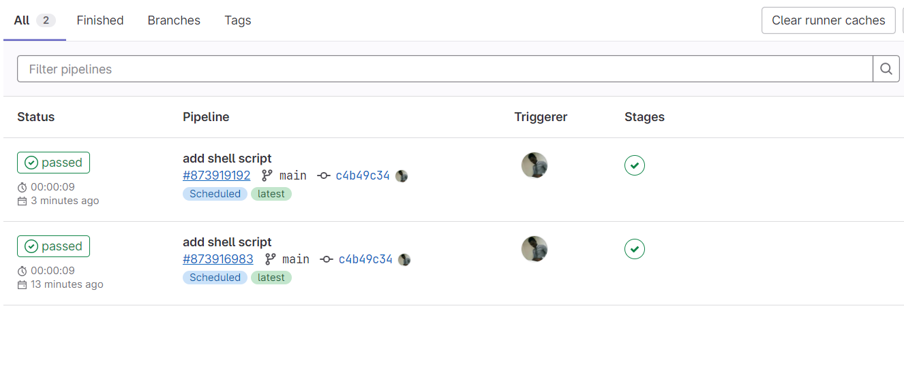
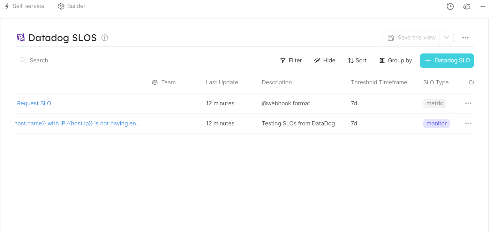

# Ingesting Datadog SLO

## Getting started

In this guide, you will go through the process of ingesting Datadog SLOs into Port, ensuring seamless integration between the two platforms. By following these steps, you will be able to create a blueprint for the `microservice` entity in Port, representing a service in your Datadog account. Additionally, you will establish a relationship between this service and the `datadogSLO` blueprint, enabling the ingestion of all defined SLOs from your Datadog account.

To ensure a successful mapping of the entities, it is crucial that the identifiers of the Port `microservice` entities match the names of the corresponding entities in your Datadog account. In cases where a mismatch occurs, you can utilize Datadog Tags to align the actual identifier in Port.

When creating your SLO in Datadog, add a tag with the name of the `micorservice` identifier in Port. You can then use the value of the `tags` property from the response of the Datadog SLO API request to establish a connection between the Datadog SLO service and the Port microservice.

## Service Blueprint
Create the service blueprint in Port [using this json file](./datadog/service.md)

## SLO Blueprint
Create the SLO blueprint in Port [using this json file](./datadog/slo.md)

### Gitlab CI yaml
Place this example `.gitlab-ci.yml` file in your project's root folder

### Gitlab CI Variables
To interact with Port using Gitlab CI Pipeline, you will first need to define your Port credentials [as variables for your pipeline](https://docs.gitlab.com/ee/ci/variables/index.html#define-a-cicd-variable-in-the-ui). Then, pass the defined variables to your ci pipeline script. Please note that by deafult, all Datadog API clients are configured to consume Datadog US site APIs (https://api.datadoghq.com). If you are on the Datadog EU site, set the environment variable DATADOG_API_URL to `https://api.datadoghq.eu`. Some Datadog clients may require you to add your account region to the API. In this case, you may change the DATADOG_API_URL to `https://api.<region>datadoghq.com` or `https://api.<region>datadoghq.eu`

The list of the required variables to run this pipeline are:
- `PORT_CLIENT_ID`
- `PORT_CLIENT_SECRET`
- `DATADOG_API_KEY`
- `DATADOG_APPLICATION_KEY`
- `DATADOG_API_URL`

### Schedule the script
1. Go to your Gitlab project and select CI/CD
2. Click on **Schedules** and create new schedule
3. Enter the necessary information into the form: the Description, Interval Pattern, Timezone, Target branch and other variables specifically for the schedule.
4. Click on **Save pipeline schedule** 

#### Screenshot - Pipeline Success

#### Screenshot - Port Entity Created

